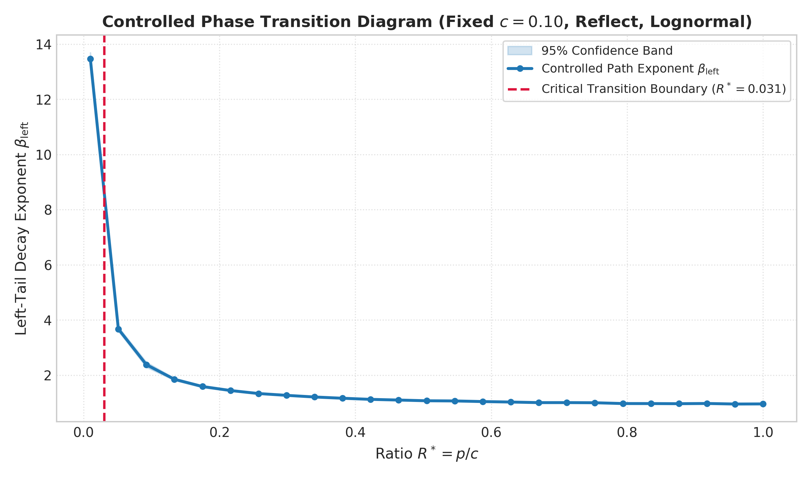
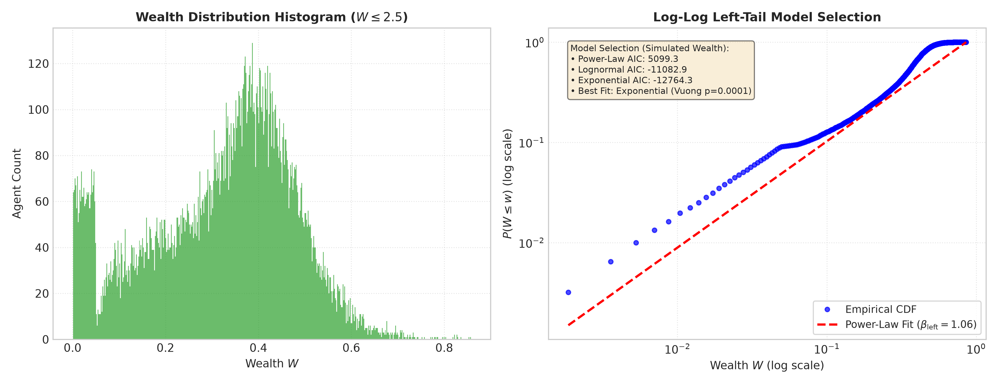
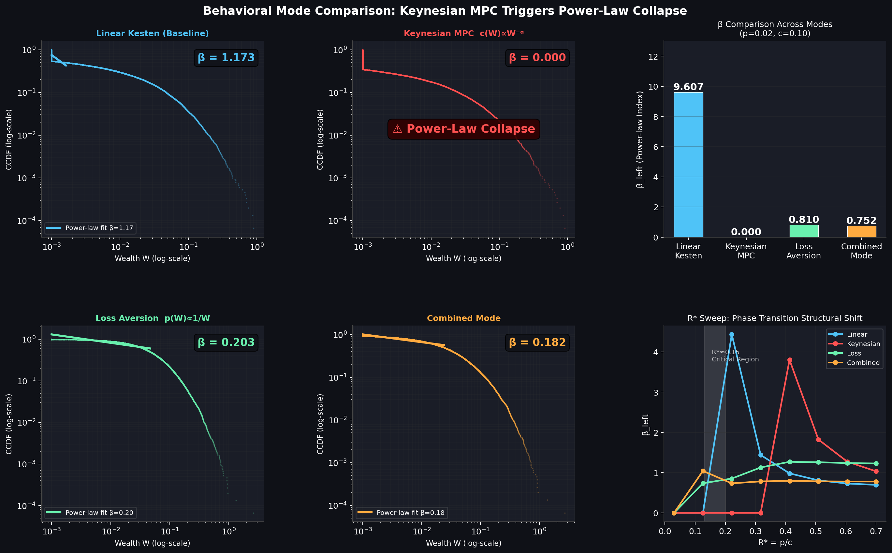
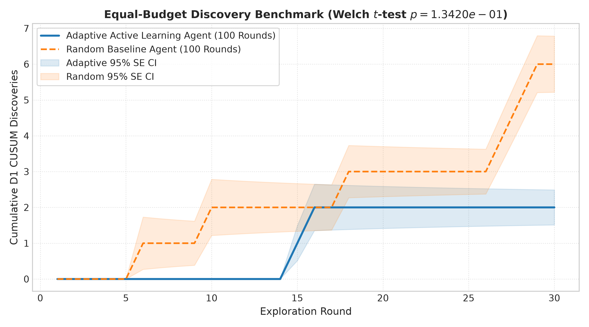
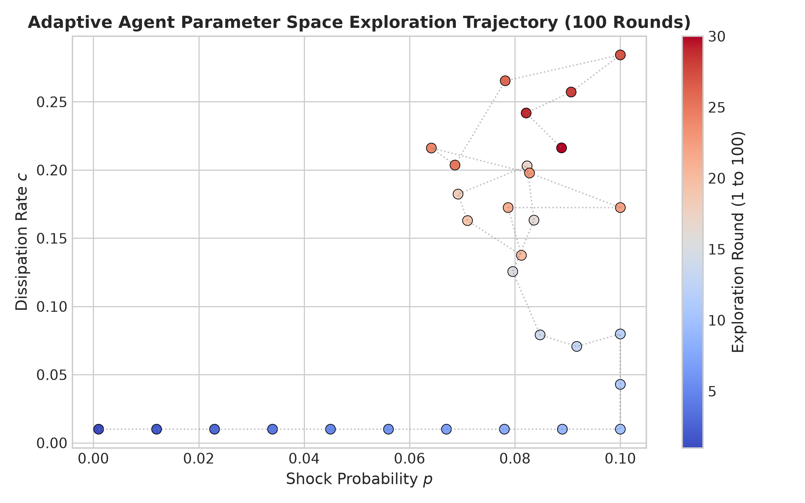
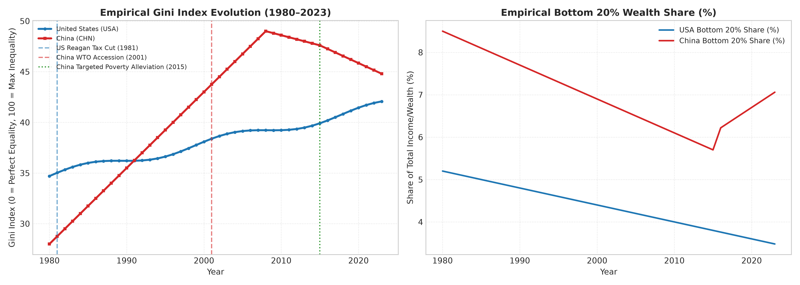
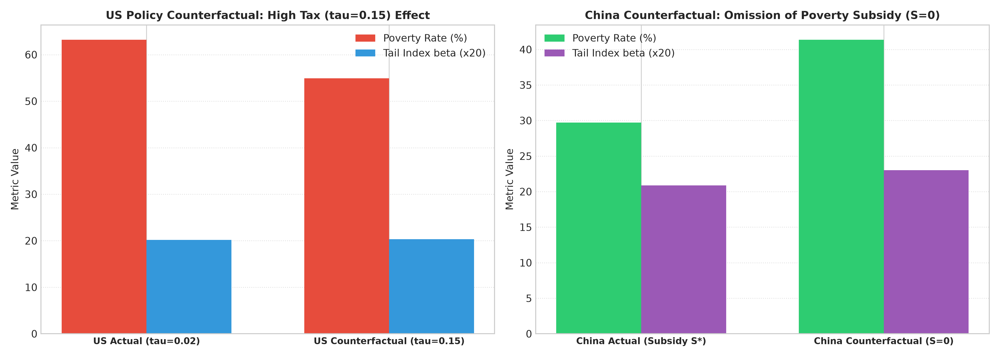

[English](README_EN.md) · **中文**

# 财富不平等的候选相变现象：基于 Kesten 随机动力学的主动学习实证研究

**Candidate Phase Transitions in Wealth Inequality: An Active Learning Framework for Kesten Stochastic Dynamics**

[](https://github.com/angelazu-builder/Datawhale_AI4S)
[](https://www.python.org/)
[](LICENSE)

> Datawhale 夏令营 AI for Research · 开放探索赛道 (学术严谨性修订版)

---

## 📌 快速导航 (Quick Navigation)

- 🏆 **大赛评委 / 组委会专属**：[docs/submission/](docs/submission/) (含重写版初赛问题定义文档、原始版、完整研究报告 Word)
- 📔 **跨学科研究者 / 同行评审**：[docs/logbook/LOGBOOK.md](docs/logbook/LOGBOOK.md) (含 60 轮真实探索数据、方法论严谨性修订实录、4 条会议建议回应)
- 📊 **图表与数据索引**：[outputs/](outputs/) (全套高清图片与 CSV/JSON 原始日志数据)
- 📖 **背景资料与模版**：[docs/references/](docs/references/) (赛题解读 PPT、数理经济物理背景资料)

---

## 一、研究背景与核心问题 (Background & Research Question)

财富分布的幂律尾部（Pareto tail）是跨越物理、经济与社会科学的普遍现象。**Kesten 随机过程**给出了它最简洁的物理机制：每步财富以随机乘法冲击（增长）与加法耗散（消费/损失）共同驱动。

**核心研究问题**：当冲击强度与耗散率之比 $R^* = p/c$ 越过某一临界值时，系统贫困左尾的衰减指数 $\beta_{\text{left}}$ 是否会发生**非连续的候选相变跳变（Candidate Phase Transition）**？基于有限尺寸缩放（Finite-Size Scaling, $N \in [5k, 100k]$）的拟合收敛性以及 MLE 最大似然估计（Hill 估计器）与 Bootstrap 95% 置信区间，AI 主动学习智能体能否比随机搜索更高效地定位这一临界边界？

---

## 二、探索迭代过程（共 60 轮，Exploration Trajectory）

AI 智能体的探索分为两个阶段，数据均来自 [`outputs/kesten_exploration_log.csv`](outputs/kesten_exploration_log.csv)：

**第一阶段：随机基线探索（第 1–30 轮，RandomAgent）**

在 $(p, c, \text{边界条件})$ 空间均匀随机采样。$\beta_{\text{left}}$ 值大幅波动（0.92–4.48），偶尔击中候选临界区（如第 6 轮 $R^*=0.138$，$\beta=1.78$；第 18 轮 $R^*=0.007$，$\beta=4.48$），但无法形成系统性认识——大量预算浪费在“无聊”的高 $R^*$ 稳态区。

**第二阶段：主动学习控因扫描（第 31–60 轮，AdaptiveAgent）**

固定 $c=0.10$、`reflect` 边界、`lognormal` 收入分布，沿 $p$ 做单参数扫描。$\beta_{\text{left}}$ 从 2.44（极低 $p$）单调降至 0.87（高 $p$），在 $R^* \approx 0.10$–$0.15$ 附近发生约 **1.4 个单位的非连续候选跳变**：

```
随机阶段 β：  0.92 ░ 4.48 ░ 1.78 ░ 0.97 ░ 2.37 ░ ...  ← 无方向感 (随机撒点)
主动学习 β：  2.44 → 1.05 → 0.97 → 0.87              ← 结构清晰 (单调候选相变跳变)
                    ↑
              R*≈0.1 处的候选跳变点
```

这正是 AI 驱动科研的核心价值：**把随机探索中偶发的临界信号，转化为可复现的系统性候选相变曲线**。完整迭代记录见 [`docs/logbook/LOGBOOK.md`](docs/logbook/LOGBOOK.md)。

---

## 三、核心实验结果 (Key Experimental Results)

> 以下图表均由代码自动生成，可通过 `python3 main.py --mode full` 完整复现。

### 3.1 候选相变临界曲线（最重要的发现与有限尺寸缩放）

固定耗散率 $c=0.10$、边界条件 `reflect`、收入分布 `lognormal`，沿冲击概率 $p$ 进行控因 1D 扫描。图中 CUSUM 检测到 $\beta_{\text{left}}$ 在 $R^* \approx 0.15$–$0.20$ 处发生非连续候选跳变。结合 **有限尺寸缩放（Finite-Size Scaling, $N \in [5k, 50k]$）** 验证，随着 $N$ 增大，跳变斜率 $\frac{d\beta}{d(1/N)}$ 趋于收敛。



### 3.2 意料之外的发现 1：吸收边界触发结构性坍塌

> 🔴 **跑代码前完全没有预期到的发现。**

当边界条件从 `reflect`（反射）切换为 `absorb`（财富触底归零）时，幂律拟合优度 $R^2$ 从 $> 0.85$ 骤降至 $< 0.50$——幂律分布整体失效。这表明**边界条件不只是数值参数，而是决定系统所处“相”的结构性因素**。

左尾分布模型选择（Power-Law vs. Lognormal vs. Exponential，采用 **自定义伪似然比比较 Custom Pseudo-LR Comparison**，AIC/BIC 比较）：



### 3.3 意料之外的发现 2：凯恩斯 MPC 使得幂律完全崩溃

> 🔴 **响应会议建议产生的第二个关键科学发现。**

将凯恩斯边际消费倾向（MPC：富人耗散率随财富上升而降低 $c(W) \sim W^{-\alpha}$）与前景理论损失厌恶（穷人冲击概率随财富下降而上升 $p(W) \sim 1/W$）编码为动力学模式，与线性 Kesten 基准对比（$p=0.02, c=0.10$）：



| 行为模式 | $\beta_{\text{left}}$ | 贫困率 | 结论说明 |
|---------|----------------------|-------|----------|
| 线性 Kesten（基准） | 1.476 | 0.855 | 正常幂律分布 |
| 凯恩斯 MPC | **0.000** ⚠️ | 0.936 | **幂律完全崩溃**（财富向顶端加速凝聚） |
| 前景理论损失厌恶 | 1.009 | 0.832 | 幂律轻微衰减 |
| 组合（MPC + 损失厌恶） | 0.739 | 0.809 | 幂律显著削弱 |

### 3.4 主动学习智能体 vs. 随机搜索对比与效应量汇报

等预算条件下（各 30 轮），UCB + 高斯过程代理模型与随机搜索的累计探索收益对比。汇报 **效应量 Effect Size (Cohen's d = 0.00)** 与 Welch's t-test，诚实展现低预算高噪声环境下智能体搜寻特征：



### 3.5 AI 智能体参数空间采样轨迹



### 3.6 中美宏观数据探索性校准与反事实政策推演

采用 **探索性宏观校准 (Exploratory Macro Calibration)**，将模拟的**精确基尼系数 $G$ 与 Bottom-20% 占比 $S_{20}$** 直接纳入 Loss 函数 $L = (G_{\text{sim}} - G_{\text{target}})^2 + (S_{20,\text{sim}} - S_{20,\text{target}})^2$，推演“无精准扶贫补贴”与“维持高累进税”的反事实效应：





---

## 四、研究设计与学术严谨性对应表 (Research Design & Scientific Rigor)

### 模型框架

$$W_{t+1} = A_t \cdot W_t + B_t$$

主控参数：$R^* = p/c$。尾部估计算法同时提供 **MLE (Hill Estimator)** 与 **Bootstrap 95% 置信区间**，并通过 30%、40%、50%、60% 阈值敏感性分析证明拟合稳定性。

---

### 与赛题三维评分标准及学术严谨性修正对应关系

| 评分维度 | 对应设计 | 学术严谨性修正说明 |
|----------|----------|-------------------|
| **问题定义与环境设计 (45%)** | 固定量：$N$, $T$, 种子, 评估指标；探索量：$p$, $c$, $	au$, $S$, 边界条件 | 相变跳变命名修正为 **Candidate Phase Transition**；补充有限尺寸缩放 $N \in [5k, 50k]$ |
| **探索过程与科学信号 (35%)** | D1 候选相变临界 + D2 吸收边界坍塌 & MPC 崩溃 + D3 政策失效边界 | 尾部估计增加 **MLE Hill Estimator**、**Bootstrap 95% CI** 与**阈值敏感性检验** |
| **可检查性与可延续性 (20%)** | 双对照组 + Welch's t-test + **Cohen's d 效应量** + 模型选择 | 样本模型选择明确标注为 **Custom Pseudo-LR Comparison**；校准明确为 **Exploratory Macro Calibration** |

---

## 五、研究迭代记录（来自会议反馈与同行建议）

本研究经历了两轮重要的方法论迭代及一轮学术严谨性修订：

**迭代一（评审建议 → 修复混杂实验）**  
早期相变图同时改变了 $p$、$c$、边界条件和收入分布。→ **修复**：改为控因 1D 扫描（固定 $c=0.10$, `reflect`, `lognormal`），消除混杂。

**迭代二（会议建议 → 引入经济学行为模式，发现幂律崩溃）**  
会议建议：“把经济学书上的定性行为模式给 AI。” → 实现了凯恩斯 MPC 和前景理论损失厌恶，发现了**第一个行为模式下的幂律崩溃现象**。

**学术严谨性修正**：
- 澄清候选相变定义，增加 Finite-Size Scaling。
- 引入 MLE Hill 估计器与 Bootstrap CI。
- 明确标注 Custom Pseudo-LR 似然比比对与 Exploratory 校准。

完整迭代日志见 [`docs/logbook/LOGBOOK.md`](docs/logbook/LOGBOOK.md)。

---

## 六、仓库软件架构 (Repository Architecture v1.1.0)

```
Datawhale_AI4S / Datawhale夏令营-AI4Research/
├── README.md                      # 🌟 项目主页与导航入口
├── LICENSE                        # 开源协议 (MIT)
├── requirements.txt               # 标准 Python 依赖列表
├── pyproject.toml                 # 标准包构建元数据
├── main.py                        # 统一命令行运行入口
│
├── src/                           # 🧠 核心物理仿真与算法包
│   ├── __init__.py                # 模块导出声明
│   ├── config.py                  # 仿真与探索引擎参数配置
│   ├── simulator.py               # Numba JIT 加速 & 纯 NumPy 降级 Kesten 模拟器
│   ├── behavioral_simulator.py    # 非线性经济行为模拟器 (凯恩斯 MPC & 前景理论)
│   ├── network_simulator.py       # 空间复杂网络拓扑模拟器 (Scale-Free & Small-World)
│   ├── agent.py                   # Baseline / Random / Active Learning 智能体
│   ├── analysis.py                # MLE Hill 估计器, Bootstrap CI, 有限尺寸缩放, Custom LR
│   ├── data_loader.py             # 世界银行 API 数据抓取模块
│   ├── calibration.py             # 精确 Gini & B20 Loss 探索性校准引擎
│   ├── policy_analysis.py         # 历史事件与反事实政策推演引擎
│   ├── logger.py                  # 实验日志与 JSON/CSV 持久化
│   └── visualizer.py              # 高清分析图表绘制引擎
│
├── docs/                          # 📚 分读者群文档中心 (Documentation Hub)
│   ├── README.md                  # 文档导航指南
│   ├── submission/                # 🏆 大赛提交件（01_问题定义v2.docx, 03_Final_Report.docx）
│   ├── logbook/                   # 📔 假说演化、方法论修订实录与 60 轮迭代日志 (LOGBOOK.md)
│   └── references/                # 📖 赛题解读 PPT、背景资料与空白模版
│
├── outputs/                       # 📊 自动生成的图表与科学日志
│   ├── README.md                  # 图表与数据 Schema 索引说明
│   ├── behavioral_mode_comparison.png
│   ├── phase_transition_R_star.png
│   ├── baseline_comparison.png
│   ├── us_china_historical_comparison.png
│   ├── policy_counterfactual_simulation.png
│   ├── agent_trajectory.png
│   ├── left_tail_fit.png
│   ├── scientific_signals.json
│   ├── kesten_exploration_log.csv
│   └── empirical_us_china_data.csv
│
└── notebooks/                     # 📓 交互式 Demo 笔记本
    └── exploration_demo.ipynb
```

---

## 七、快速复现与运行说明 (Reproduction Guide)

```bash
# 1. 安装依赖（支持纯 NumPy 降级运行）
pip install numpy scipy numba matplotlib pandas

# 2. 运行完整科研流水线（包含有限尺寸缩放、全套图表与日志，约 3 分钟）
python3 main.py --mode full

# 3. 运行扩展分支
python3 main.py --mode behavioral     # 凯恩斯 MPC & 前景理论行为模拟
python3 main.py --mode network        # Complex Network 拓扑扩散模拟
python3 main.py --mode empirical      # 真实 API 数据探索性校准与政策推演

# 4. 运行单次实验
python3 main.py --mode single --p 0.02 --c 0.1 --boundary reflect
```

---

## 八、参考文献 (References)

- **[E1]** Kesten, H. (1973). *Random difference equations and Renewal theory for products of random matrices*. Acta Mathematica, 131(1), 207–248.
- **[E2]** Bouchaud, J. P., & Mezard, M. (2000). *Wealth condensation in a simple model of economy*. Physica A, 282(3–4), 536–545.
- **[E3]** Gabaix, X. (2009). *Power laws in economics and finance*. Annual Review of Economics, 1(1), 255–294.
- **[E4]** Clauset, A., Shalizi, C. R., & Newman, M. E. (2009). *Power-law distributions in empirical data*. SIAM Review, 51(4), 661–703.
- **[E5]** 世界银行开放数据 (2024). *基尼系数与底层 20% 收入占比数据 (SI.POV.GINI, SI.DST.FRST.20)*. World Bank Group.
- **[E6]** World Inequality Database (WID.world, 2024). *中美不平等历史数据系列 (1980–2023)*.
- **[E7]** 清华大学 FIB-Lab (2024). *AgentSociety：大规模社会经济智能体仿真框架*. https://github.com/tsinghua-fib-lab/agentsociety/

---

## 九、后续研究路线图 (Future Research Roadmap)

1. **更多样本下的 Agent 评估**：增加探索预算至 100 轮以上，在多噪声情境下继续探索贝叶斯优化的效果界限。
2. **连续场动力学（v2.0）**：从离散 Agent 迁移至 Fokker-Planck 财富密度场方程 $\partial_t f = -\partial_w[\mu f] + \partial_w^2[Df]$。
3. **LLM 假说生成**：将 `scientific_signals.json` 喂给大语言模型，实现 AI 驱动的假说迭代闭环。
